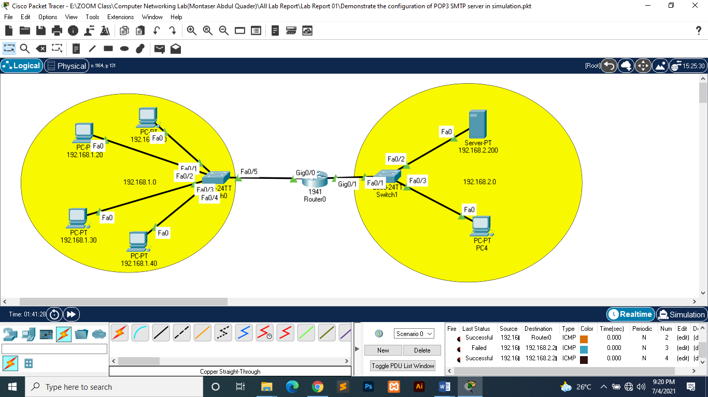

# Output

---
<h1>Green University of Bangladesh </h1>

<h2>Dept. of Computer Science Engineering</h2>

Course Title: Computer Networking Lab

Course Code: CSE-312

Lab Report

Software name: Packet Tracer 800, FileZilla and Thunderbird Setup (78.11.0)

Include all Raw file

---

 Lab Report: 01
---

1) Raw File name: Demonstrate the configuration of POP3 SMTP real environment
2) Demonstrate the configuration of POP3 SMTP server in simulation

---

---

<h1 id="test-title">Lab Report (01) in PDF</h1>

<object data="loremipsum.pdf#page=2" type="application/pdf" width="700px" height="700px">
    <embed src="loremipsum.pdf#page=2">
        
Click here for Lab Report: <a href="Lab_Report-01.pdf">Download PDF</a>.

    </embed>
</object>

---

 Lab Report: 02
---

<!-- all link is here -->

### Contact me:

[E-mail](tanvirpoly@gmail.com)

[Linkedin]( https://www.linkedin.com/in/tanvirx/)

[Facebook]( https://www.facebook.com/tanvirfbid)

